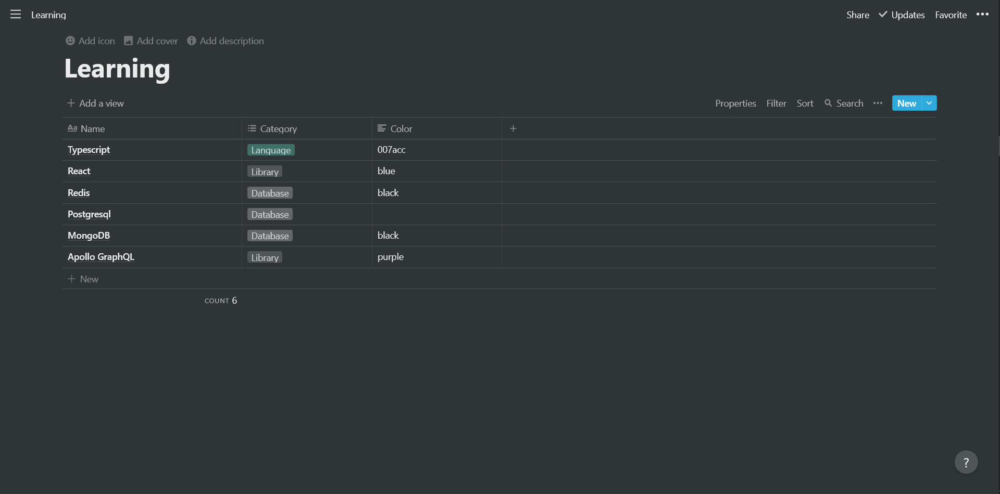

<p align="center"><a href="/" rel="noopener noreferrer"></a></p>

<h1 align="center">Github Readme Learn Section - <i>Github Action</i></h1>
<div align="center"><b>Automatically update your github README with data fetched from a notion database</b></div>
</br>
<p align="center">
  <a href="https://app.codecov.io/gh/Devorein/github-readme-learn-section-notion/branch/master"></a>
  <a href="https://github.com/Devorein/github-readme-learn-section-notion/actions/workflows/build.yml"></a>
  
  
</p>

## Configuration

|    Option     |                               Description                                | Required | Default |
| :-----------: | :----------------------------------------------------------------------: | :------: | :-----: |
| `database_id` |            Set this to the id of your remote notion database             |   true   |    -    |
|  `token_v2`   | Set this to your notion `token_v2` (Required only for private databases) |  false   |    -    |

## Usage

### In Repository File

#### 1. Add the following content to your `README.md`

```markdown
## What I know so far

<!--START_SECTION:learn-->
<!--END_SECTION:learn-->
```

#### 2. Configure the workflow

```yaml
name: 'Github Readme Updater'
on:
  workflow_dispatch:
  schedule:
    - cron: '0 0 * * *' # Runs Every Day
jobs:
  update_learn:
    name: 'Update learn section'
    runs-on: ubuntu-latest
    steps:
      - name: 'Fetching Repository Contents'
        uses: actions/checkout@main
      - name: 'Learn Section Updater'
        uses: 'devorein/github-readme-learn-section-notion@master'
        with:
          database_id: '6626c1ebc5a44db78e3f2fe285171ab7'
          token_v2: ${{ secrets.NOTION_TOKEN_V2 }} # Required only if your database is private
```

**TIP**: You can test out using [this template](https://www.notion.so/devorein/6c46c1ebc5a44db78e3f5fe285071ab6?v=0bc36e7c59e54f34b0838956e35b4490) that I've created, or [this repo](https://github.com/Devorein/test-github-action).

### In your notion account

#### 1. Create a full page database



**NOTE**: Your database must maintain the following structure/schema

|   Name   |  Type  | Required | Default |               Description               |                                      Value                                      |                 Example                  |
| :------: | :----: | :------: | :-----: | :-------------------------------------: | :-----------------------------------------------------------------------------: | :--------------------------------------: |
|   Name   | title  |   true   |    -    |   The name of the item you've learnt    | Must be a valid icon from `https://simple-icons.github.io/simple-icons-website` |            React, Typescript             |
| Category | select |   true   |    -    | The category under which the item falls |                                   Any string                                    |            Language, Library             |
|  Color   |  text  |  false   |  black  |      Background Color of the badge      |               Any keyword color or hex value without alpha and #                |                red,00ff00                |
|  Base64  |  text  |  false   |   ""    |      Custom base64 of the svg logo      |                             Any base64 encoded svg                              | data:image/svg%2bxml;base64,PHN2ZyB4b... |

#### 2. Get the id of the database


#### 3. Add it in workflow file

```yaml
with:
  database_id: '6626c1ebc5a44db78e3f2fe285171ab7'
```

Follow the rest of the steps only if your database is not public, if its public you don't need to set the token_v2

#### To make your database public

1. Navigate to the database in your notion account
2. Click on Share at the top right corner
3. Click on Share to Web button.

#### 1. Get your notion `token_v2`

**NOTE**: By no means should you share or expose your notion `token_v2`. If you feel like you've done so accidentally, immediately log out from that account in all of your devices.

Follow the steps below to obtain your `token_v2`:

1. Open up the devtools of your preferred browser.
2. Go to the Application > Cookies section.
3. There you'll find a `token_v2` cookie.

**NOTE**: Its highly recommended to store your `token_v2` as a github secret rather than pasting it in your workflow file. And if you want to embed it in your workflow file make sure unauthorized sources can't access/view it.

#### 2. Create a github secret to store `token_v2`

1. navigate to the url `https://github.com/<USERNAME>/<REPO-NAME>/settings/secrets/actions`
2. Click on `New repository secret`
3. You can name your secret as anything you want
4. Paste the `token_v2` value in the `Value` textarea
5. Use the secret in your workflow file

```yaml
with:
  token_v2: ${{ secrets.NOTION_TOKEN_V2 }} # The secret was named NOTION_TOKEN_V2
```

### Outcome

If you follow all the steps properly your readme should look something like this.


Feel free to submit a pull request or open a new issue, contributions are more than welcome !!!
